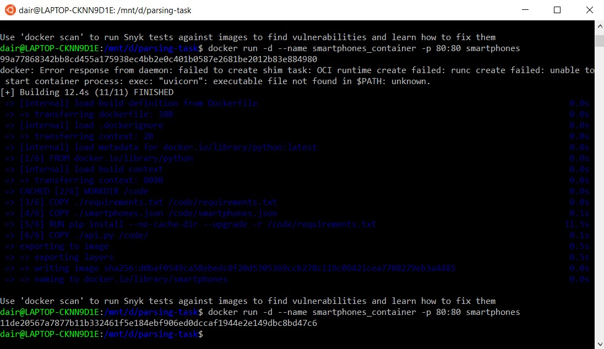
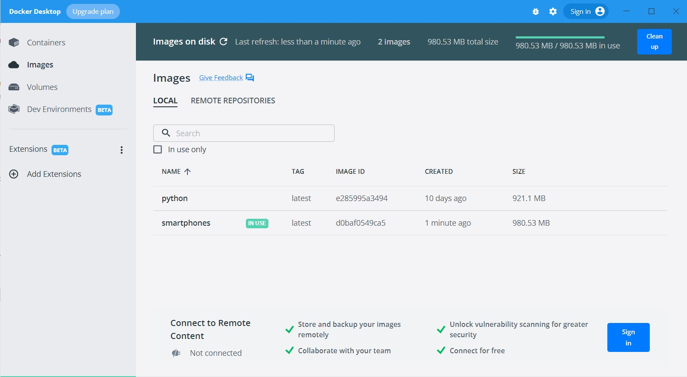
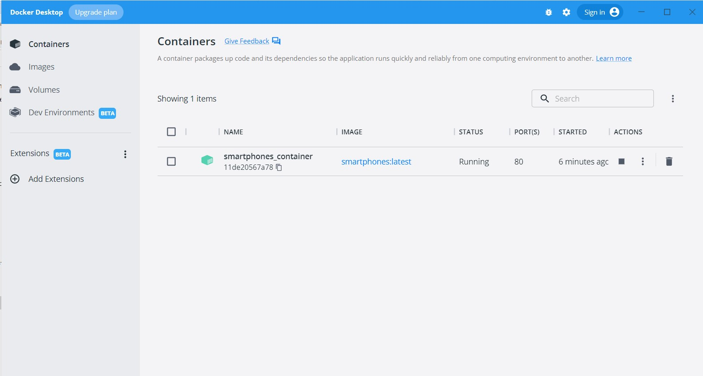
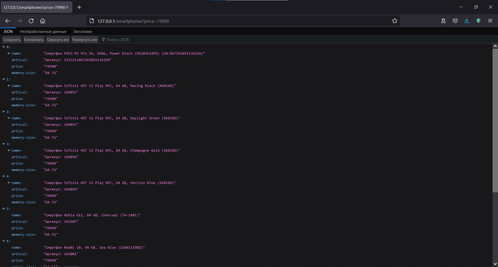
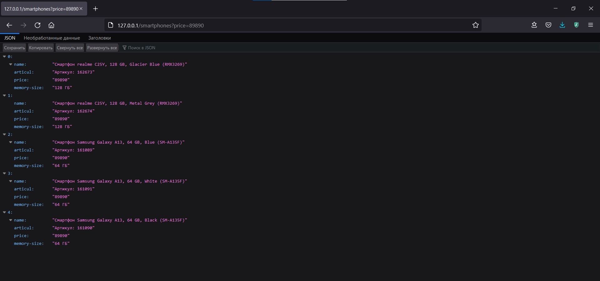
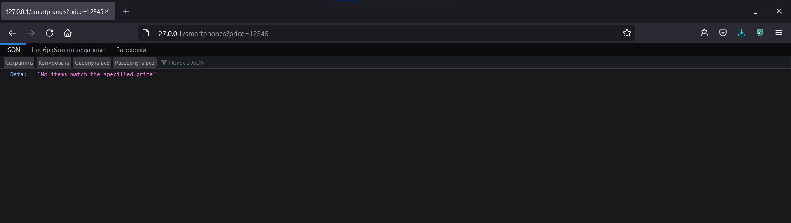

## Part 1 ##

Parsing is done via `parse_script.py` which uses Beautiful Soup 4 module and writes the scraped data to `smartphones.json`.

## Part 2 ##

The API is implemented using FastAPI.
 
The Docker image is created using the [official guide](https://fastapi.tiangolo.com/deployment/docker/).

### Creating Docker image and container ###

### Running ###

